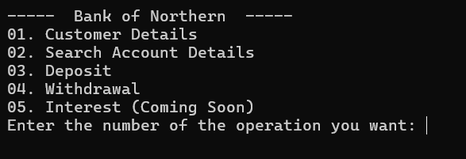
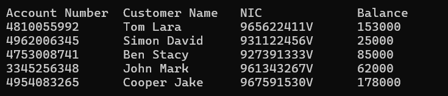
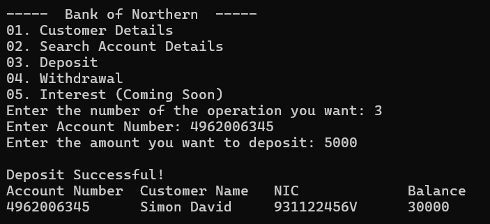

# 🏦 Bank Management System (C++)

This is a simple **Bank Management System** developed using **C++**, designed for beginners who want to practice basic concepts of programming such as arrays, conditionals, loops, and functions.

The system allows the user to:
- ✅ View all customer account details
- 🔍 Search for account information using NIC
- 💰 Deposit money into an account
- 💸 Withdraw money with balance checking
- 📊 Display account types and balances

---

## 🚀 Features

- Simple menu-driven interface
- Stores data using arrays (up to 5 customers)
- Checks account number or NIC validity
- Prevents withdrawal if the balance is too low

---

## 🧪 Technologies Used

- C++
- Console Application (runs on CodeBlocks, Dev-C++, Visual Studio, etc.)

---

## 📸 Screenshots

> Below are some screenshots of the console output.

### 🔷 Main Menu

### 🔍 Customer Details

### 💰 Deposit Money

---

## 📌 Note

This project is made for learning purposes only and does not include file handling or databases.

---

## 👨‍💻 Author

**Tasuntha Chathunika**  
📍 2nd Year ICT Undergraduate – University of Vavuniya  
🔗 [GitHub Profile](https://github.com/Tasuntha-Chathunika)
